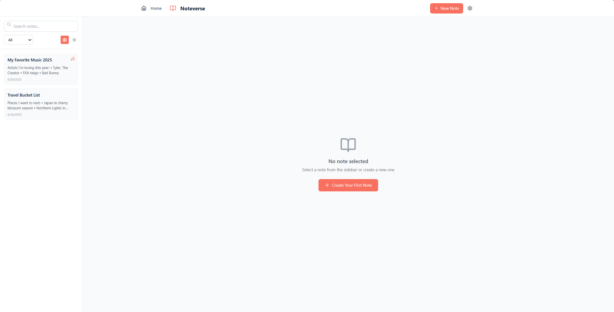
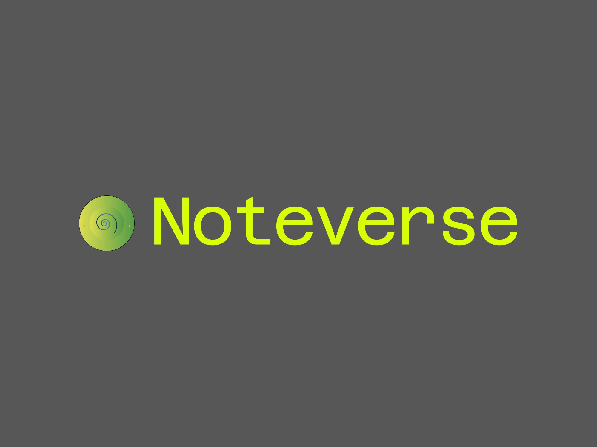

## 🚀 NoteVerse - Personal Note Manager

NoteVerse is a cross-platform note-taking app built with React, Electron, Vite, and Tailwind CSS. It lets users create, edit, organize, and customize notes with themes, categories, and multimedia tools.

### ✅ New Features Added

- ⚙️ Dynamic layout with reusable components (HeroSection, Navbar, Footer, etc.)
- 🧠 Functional Notes App UI (create, edit, delete notes)
- 🎨 Custom branding and logo design
- 📌 Pinterest API integration requested (pending approval)
- 🔐 Privacy Policy page created
- 💾 State management via React hooks
- 🧱 SQLite integration planned

### 🖼️ Screenshots

#### 📌 Main Interface



#### 🎨 Loading screen


#### 📱 App Logo



### 🧰 Tech Stack

- React
- Electron
- Vite
- Tailwind CSS
- Lucide React Icons
- Better-SQLite3 (planned)
- Pinterest API (in progress)

### 📜 Privacy Policy

Hosted at: [Privacy Policy](NoteVerse/src/assets/privacy/PRIVACY.MD) and (https://www.privacypolicies.com/live/273ecd2e-d652-475e-8a2f-306ed8a24dde)

---

### 🔧 How to Run

```bash
npm install
npm run dev
```
